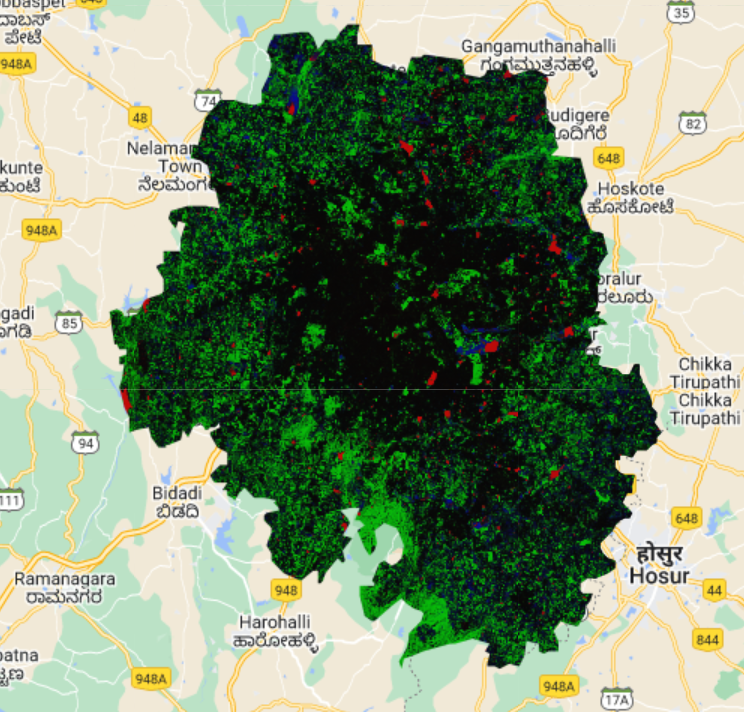
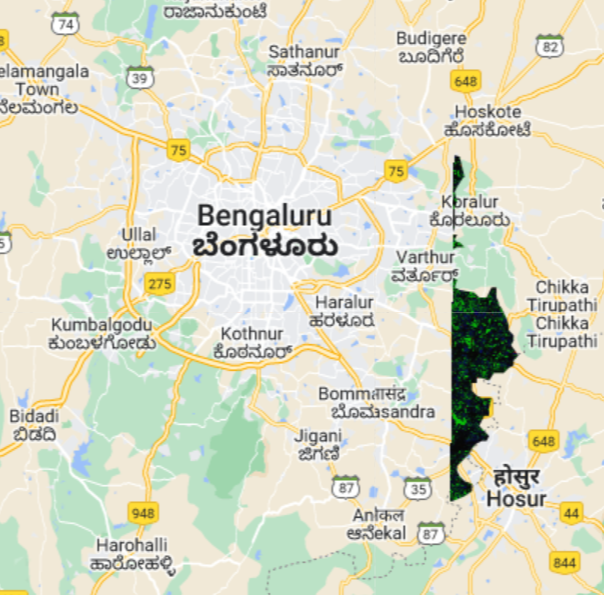
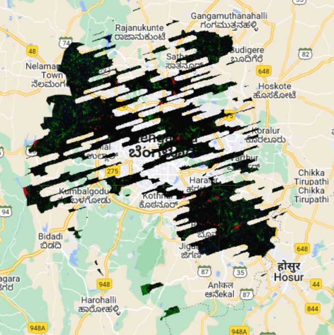

Credits: https://github.com/google/dynamicworld
# Overview
This repo contains filtering modules for dynamic world data available on google earth engine. The filtering functions have been written to aid in time-series analysis and solve problems such as poor predictions due to cloudy or unforseen weather conditions through the utilisation previous trust-worthy values. It can also be used for the Sentinel-2 data catalogue. It also contains example codes on change detection post filtering the data with the modules available in this repo. The data thus generated can be visualized with a flask application that can be run with the main.py file in the app folder.

Important files:
- [ge_cd.ipynb](ge_cd.ipynb): Example notebook that filters the images from dynamic world and saves aggregate data in the form a json file that can be imported to a dataframe or for visualization. An example of visualizing the data is also present in the notebook
- [main.py](app/main.py): A flask application that visualises the data stored in json format

# Description
The filtering modules available in this repo are:
1. mosaicSamedayImage: In the google earth image collection, you will get multiple images for the same day which originates from multiple tiles where the original image was captured from the satellite. Post mosaic, you get a new image collection with composites of all such images as a single image with a timstamp that removes the time of capture and only retains day, month and year in the metadata. For eg:, in the Bangalore urban region, we have two images shown below both of which are captured on 2016-01-11:

| Tile 1 - 2016-01-11           |  Tile 2 - 2016-01-11 |
:-------------------------:|:-------------------------:
GOOGLE/DYNAMICWORLD/V1/20160110T051202_20160110T052202_T43PHQ | GOOGLE/DYNAMICWORLD/V1/20160110T051202_20160110T052202_T43PGQ
 | 

2. computeMonthlyMedians: It takes an image collection and returns another image collection where each image is the median of all images that were captured in that particular month

3. **forward_fill**: This is an important filtering function that comes with this repo. One of the major issues with time-series analysis is that values for a particular pixels may be missing in subsequent images after creating masks on cloudy regions. Therefore, when generating aggregate statistics such as total vegetation cover, total croplands, rate of increase of construction etc for a region our analysis are greatly affected by the null values present for a period of month. The approach that has been taken in this repo says that *if for a certain period of time, I am not able to analyze the some of the pixels on a particular site because it is covered by cloud, I will assume the last known data for that particular pixel as current knowledge until and unless clouds have cleared and I can see what is happening.* This has been achieved by recording all the known values for all pixels for a time stamp and carrying it forward to the next image in the image collection if that pixel is masked by clouds.

|      Cloudy tiles        | Post forward_fill  |
:-------------------------:|:-------------------------:
 | 

